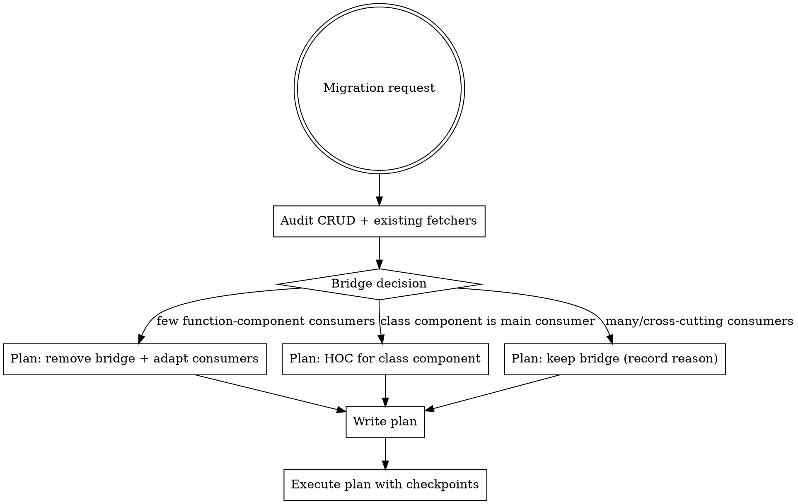

# Calypso React Query Migration

Target architecture: **fetchers in `@automattic/api-core`** → **query/mutation options in `@automattic/api-queries`** → **components call `useQuery()` / `useMutation()` directly**.

Two source patterns migrate into it:
1. **Redux data-layer** (`dispatchRequest` + `http` actions in `client/state/data-layer/wpcom/read/`)
2. **`@automattic/data-stores`** Reader hooks (custom hooks using `wpcomRequest`)

## Quick Reference: Where Things Go

| What | Where |
|------|-------|
| API fetcher | `packages/api-core/src/read-{name}/fetchers.ts` |
| Mutators | `packages/api-core/src/read-{name}/mutators.ts` |
| Response types | `packages/api-core/src/read-{name}/types.ts` |
| Barrel | `packages/api-core/src/read-{name}/index.ts` + add to `packages/api-core/src/index.ts` |
| Query/mutation options | `packages/api-queries/src/read-{name}.ts` + add to `packages/api-queries/src/index.ts` |
| Bridge component (if kept) | `client/components/data/query-reader-{name}/index.tsx` |
| Component tests | `client/components/data/query-reader-{name}/test/index.test.tsx` |
| Redux to remove | `client/state/data-layer/wpcom/read/{name}/index.js`, `client/state/reader/{name}/{actions,reducer}.{ts,js}`, `client/state/reader/action-types.ts` |

### Naming conventions (must follow)

Every Reader fetcher / query / mutation / response type carries the `Read` prefix — the rest of `api-core` and `api-queries` does this consistently and breaking the pattern stands out in code review.

| Kind | Pattern | Examples |
|------|---------|----------|
| Fetcher | `fetchRead{Name}` | `fetchReadFeed`, `fetchReadSubscriptionDetails` |
| Query factory | `read{Name}Query` | `readFeedQuery`, `readSubscriptionDetailsQuery` |
| Mutation factory | `{verb}Read{Name}Mutation` | `addReadListFeedMutation`, `unfollowReadTagMutation` |
| Response types | `Read{Name}Response`, `Read{Name}ErrorResponse` | `ReadFeedSearchResponse`, `ReadSubscriptionDetailsResponse` |
| Args/params types | `Read{Name}Args`, `FetchRead{Name}Params` | `ReadSubscriptionDetailsArgs` |

## Workflow (Required)



**Always plan before editing.** A one-line request like "migrate QueryReaderTag" is a spec — turn it into a plan first.

**REQUIRED SUB-SKILLS:**
- `superpowers:writing-plans` — to draft the plan
- `superpowers:executing-plans` — to execute it with checkpoints

The plan must include: full CRUD audit, bridge decision (with reason), commit split, per-mutation invalidations + optimistic-update decision, list of consumers to update, test plan.

Save the plan to `.context/plan-migrate-reader-{name}.md`.

## Step 1: Audit before writing

### CRUD coverage
List every action for the resource — read AND mutations. Partial migrations create two sources of truth (deleted item still shows in sidebar until refresh).

```bash
grep -E "READER_[A-Z_]*" client/state/data-layer/wpcom/read/{name}/index.js
grep -E "READER_[A-Z_]*" client/state/reader/{name}/actions.ts
```

| Operation | Redux pattern | Target |
|-----------|---------------|--------|
| Read | `READER_XXX_REQUEST` → `dispatchRequest` GET | `useQuery(readXxxQuery(...))` |
| Create / Update / Delete | `READER_XXX_*` → `dispatchRequest` POST | `useMutation(...Mutation())` |
| Follow / Unfollow | `READER_XXX_FOLLOW` etc. | dedicated mutation each |

Plan one commit per action group; each commit removes its Redux counterpart (mutations don't need a bridge).

### Existing `api-core` fetchers
Don't duplicate. Grep before creating:

```bash
grep -rn "/read/{endpoint}" packages/api-core/src/
ls packages/api-core/src/ | grep -i {name}
```

If a fetcher exists: **reuse** (import from `@automattic/api-core`) or **extend** (add to existing folder, not a parallel one).

### Cache-key consumers (mandatory check)
**Before changing or replacing a query key, find every other piece of code reading or writing it.** Mutations and shared helpers commonly do optimistic `setQueryData` / `invalidateQueries` against the old key — change the key without updating them and they silently no-op, leaving the user looking at stale data after every action.

```bash
# Find every reference to the existing key.
grep -rn "['\"]{old-key-segment}['\"]" packages/ client/ --include="*.ts" --include="*.tsx"

# Also check the shared helpers, which often centralize optimistic logic.
grep -rn "alter{Name}\|invalidate{Name}" packages/data-stores/src/reader/helpers/
```

For every match, decide:
- **Update to the new key** (preferred — small follow-up patch in the same PR, or co-located mutation migration).
- **Migrate the consumer too** (when it's a mutation that should join this migration anyway).
- **Bridge** (last resort: keep the old key alive in parallel until the consumer is migrated).

Document the decision per match in the plan. The trap: when the only consumer of the old key is a mutation's optimistic write, deleting the data-stores hook *looks* clean — `grep` for the hook name finds nothing — but the mutation still operates on a phantom cache that no live query reads, and the visible page never updates after the user acts.

## Step 2: Bridge decision

The `QueryReader*` bridge dispatches `RECEIVE` so the rest of Calypso keeps reading from Redux. **It's not the long-term target.** Evaluate removing it in this migration before defaulting to keeping it.

```bash
# Render sites
grep -rn "QueryReader{Name}" client/ --include="*.{ts,tsx,js,jsx}"
# Indirect Redux consumers
grep -rn "get{Name}\|isRequesting{Name}" client/ --include="*.{ts,tsx,js,jsx}"
```

| Audit result | Recommended decision |
|--------------|----------------------|
| 1–3 function-component consumers, slice not read elsewhere | **Remove bridge.** Adapt consumers to `useQuery`. Delete `RECEIVE` action, reducer, selectors. |
| Class component is the main consumer | **Wrap class with HOC** that calls `useQuery()` and forwards props. Delete bridge + slice. (See [redux-cleanup.md](redux-cleanup.md) for the HOC pattern.) |
| Many consumers, or selectors used cross-codebase, or cross-Reader code reads slice | **Keep bridge.** Record reason in plan; note as follow-up. |

Record the decision verbatim in the plan. When removing the bridge, `grep` to confirm nothing else reads `RECEIVE`/reducer/selectors before deleting them.

## Step 3: Build the migration

### Create the fetcher (`api-core`)

```typescript
// packages/api-core/src/read-{name}/fetchers.ts
import { addQueryArgs } from '@wordpress/url';
import { wpcom } from '../wpcom-fetcher';
import type { ReadXxxResponse } from './types';

export const fetchReadXxx = ( params?: SomeParams ): Promise< ReadXxxResponse > => {
  return wpcom.req.get( {
    path: addQueryArgs( '/read/endpoint', { key: 'value' } ),
    apiVersion: '1.2',
  } );
};
```

Find `method`, `path`, `apiVersion`, and `query`/`body` in the existing data-layer `http()` call. Copy exactly. Always import `wpcom` from `../wpcom-fetcher` (not directly).

Add types in `types.ts`, barrel-export from `index.ts`, then export the module from `packages/api-core/src/index.ts`.

#### Subkey-auth fallback (logged-out subscription-management endpoints)

Some Reader endpoints (`/read/sites/{blogId}/subscription-details`, `/read/subscriptions/{id}`, anything reachable from the public `/subscriptions/...` landing pages) accept logged-out callers via an `X-WPSUBKEY` header. The legacy data-stores `callApi` helper handles this; `wpcom.req.get` does not, because `wpcom-proxy-request` requires a session.

Trigger: the source hook calls `callApi` with an `isLoggedIn` arg, or imports `getSubkey`, or the consumer renders under a `/subscriptions/...` route.

Before designing the fork, confirm with backend:
- Does the endpoint accept **both** cookie auth and `X-WPSUBKEY`?
- If both arrive, which wins? (Calypso ships the cookie unconditionally for logged-in users, so the answer affects whether the subkey path is safe to take preemptively.)
- When is `window.currentUser.subscriptionManagementSubkey` populated? (Today: only the logged-out subscriptions bootstrap.)

Pattern when both auth modes are accepted and cookie wins server-side — the bifurcation becomes pure transport, not URL or auth strategy:

```typescript
const getSubkey = (): string | undefined =>
  ( window as typeof window & { currentUser?: { subscriptionManagementSubkey?: string } } )
    .currentUser?.subscriptionManagementSubkey;

export const fetchReadXxx = async ( params ): Promise< ReadXxxResponse< string > > => {
  const path = `/read/...`;
  const subkey = getSubkey();

  if ( subkey ) {
    const response = await fetch( `https://public-api.wordpress.com/wpcom/v2${ path }`, {
      method: 'GET',
      credentials: 'same-origin',
      headers: {
        Authorization: `X-WPSUBKEY ${ encodeURIComponent( subkey ) }`,
        'Content-Type': 'application/json',
      },
    } );
    return response.json();
  }

  return wpcom.req.get( { path, apiNamespace: 'wpcom/v2', apiVersion: '2' } );
};
```

Use raw `fetch` rather than `@wordpress/api-fetch` — avoids adding the dep to `api-core` and the subkey path needs none of `apiFetch`'s middleware. The `client/lib/request-with-subkey-fallback/` helper does the same thing for non-Reader code, but **don't import it from `api-core`** (wrong direction); inline the logic.

### Create the query options (`api-queries`)

```typescript
// packages/api-queries/src/read-{name}.ts
import { fetchReadXxx } from '@automattic/api-core';
import { queryOptions } from '@tanstack/react-query';

export const readXxxQuery = ( param?: string | null ) =>
  queryOptions( {
    queryKey: [ 'read', 'xxx', param ],
    staleTime: 1000 * 60 * 5,
    queryFn: () => fetchReadXxx( param! ),
    enabled: param != null,
  } );
```

`queryKey`: `['read', '{domain}', ...params]`. `staleTime`: ~1min for data with external change events (payments, renewals, server-side mutations), ~5min for slowly-changing lists. Confirm change-rate with backend when unsure. `enabled`: when params can be null.

When migrating from `data-stores`, **preserve the same `queryKey`** for cache compatibility mid-session.

### Bridge component (only if kept)

```typescript
// client/components/data/query-reader-{name}/index.tsx
import { readXxxQuery } from '@automattic/api-queries';
import { useQuery } from '@tanstack/react-query';
import { useEffect } from 'react';
import { useDispatch } from 'react-redux';
import { receiveXxx } from 'calypso/state/reader/xxx/actions';

export default function QueryReaderXxx() {
  const dispatch = useDispatch();
  const { data } = useQuery( readXxxQuery() );

  useEffect( () => {
    if ( data?.items ) dispatch( receiveXxx( data.items ) );
  }, [ data, dispatch ] );

  return null;
}
```

If the legacy code dispatched success/failure actions, mirror both via `isSuccess` / `isError` effects.

### Tests

See [test-scaffolding.md](test-scaffolding.md) for the full template (`createTestStore`, `renderWithProviders`, `nock` setup).

nock URL: `https://public-api.wordpress.com/rest/v{apiVersion}/{path}` for `wpcom.req.get` calls, `https://public-api.wordpress.com/wpcom/v2{path}` for `apiNamespace: 'wpcom/v2'` v2 calls. Run with `yarn test-client client/components/data/query-reader-{name}/test/`.

### Mutations

See [mutations.md](mutations.md) — covers mutators, `mutationOptions`, cache invalidation rules, optimistic updates (default for user-facing mutations), and where side effects live (consumer's `onSuccess`, not api-queries).

### Migrating from `data-stores`

Same fetcher/query pattern, with two differences:
- **No bridge needed** — the consumer already uses React Query; just swap the import.
- **Single commit** — no Redux cleanup.

```typescript
// Before
import { Reader } from '@automattic/data-stores';
const { data, isFetching } = Reader.useReadFeedSiteQuery( siteId );

// After
import { readFeedSiteQuery } from '@automattic/api-queries';
import { useQuery } from '@tanstack/react-query';
const { data, isFetching } = useQuery( readFeedSiteQuery( siteId ) );
```

After updating consumers, delete the hook from `packages/data-stores/src/reader/queries/` and remove its export from the Reader barrel.

## Step 4: Clean up Redux

Read [redux-cleanup.md](redux-cleanup.md) for: per-action checklist, replacing `isRequesting*` selectors with React Query state, function-component `connect()` → hooks conversion, and the class-component HOC pattern.

Cleanup is a separate commit from the migration commit — easier to review and revert.

## Red Flags — STOP

If you catch yourself doing any of these, stop and reconsider:

- About to edit `api-core`, `api-queries`, `client/components/data/query-reader-*`, or Redux Reader state **without a written plan** → write the plan first.
- About to migrate only the read query while leaving CREATE/UPDATE/DELETE in Redux → finish the CRUD audit first.
- About to create `packages/api-core/src/read-{name}/` without grepping for an existing module → check `api-core` first.
- About to delete an `isRequesting*` selector or `RECEIVE` reducer without grepping for consumers → grep first.
- About to write a mutation with only `invalidateQueries` and no `onMutate` for a user-facing action → consider optimistic updates.
- About to put navigation / notice dispatch inside the mutation's `onSuccess` in `api-queries` → side effects belong in the **consumer**'s `onSuccess`.
- About to rewrite a class component to a function component as part of this migration → out of scope; use an HOC instead.
- About to change the `queryKey` when migrating from `data-stores` → preserve it for mid-session cache compatibility.
- About to delete or rename a query key without grepping for **every** consumer (mutations, optimistic-update helpers, selectors, other queries that prefix-invalidate it) → grep first; mutations referencing a now-orphan key silently no-op and the visible page stops updating after user actions.

## Common Mistakes

| Mistake | Fix |
|---------|-----|
| Forgetting to dispatch `RECEIVE` from the bridge | Other code still reads from Redux — bridge is required when kept |
| Wrong nock URL (missing `/rest/v{N}/`) | Always `https://public-api.wordpress.com/rest/v{apiVersion}/{path}` |
| Removing unrelated handlers from data-layer file | Surgical removal — only the specific REQUEST handler |
| Missing `enabled` when query has required params | Query fires with `undefined` and fails |
| Cleanup in same commit as migration | Keep separate for reviewability |
| `.jsx` for a new file | Always `.tsx` |
| Forgetting barrel exports | Update `api-core/src/index.ts` AND `api-queries/src/index.ts` |
| Importing `wpcom` directly | Always from `../wpcom-fetcher` |
| `invalidateQueries` for a deleted item's detail query | Use `removeQueries`; `invalidateQueries` for list |
| Forgetting `cancelQueries` before optimistic write | An in-flight refetch can overwrite your optimistic value |
| Skipping `onSettled` invalidation in optimistic mutation | Optimistic value drifts from server truth |
| Leaving `connect()` HOC after request state moved to React Query | Convert to hooks, remove HOC entirely (function components only) |
| Leaving the old `data-stores` hook exported | Delete file AND remove from Reader barrel |
| Naming the fetcher / query without the `Read` prefix | Match other modules: `fetchRead{Name}`, `read{Name}Query`, `Read{Name}Response` |
| Importing `client/lib/request-with-subkey-fallback/` from `api-core` | Wrong dependency direction — inline the subkey + `X-WPSUBKEY` logic in the fetcher |
